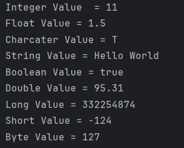
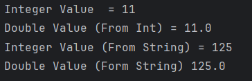
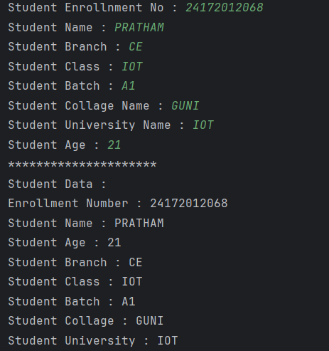
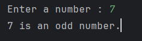
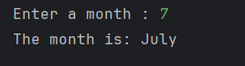
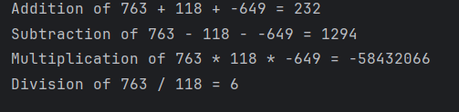
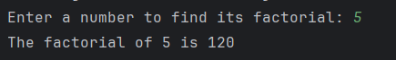
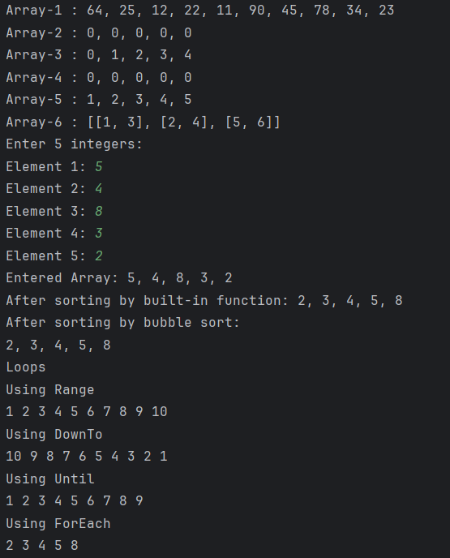
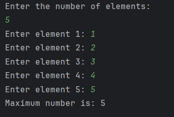
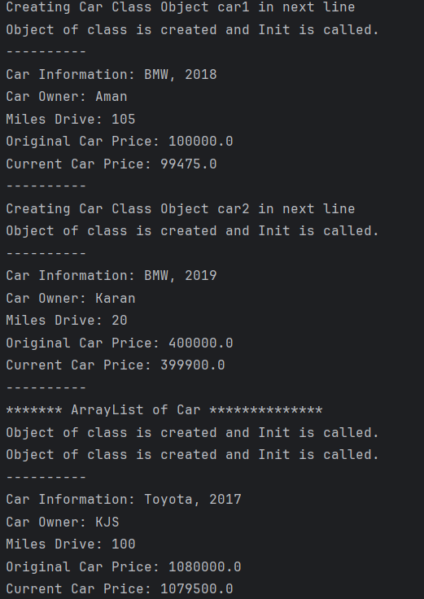

# 📘 Practical-1: Kotlin Programming Concepts

## 🧪 Objective
The objective of this practical is to demonstrate proficiency in Kotlin programming by implementing various fundamental concepts.

---

## 📝 Tasks and Aims

### 1.1 Store & Display Values in Different Variables
**Aim:**  
To declare and display variables of various data types such as Integer, Double, Float, Long, Short, Byte, Char, Boolean, and String.

**Output:**  

---

### 1.2 Type Conversion
**Aim:**  
To perform type conversions such as Integer to Double, String to Integer, and String to Double.

**Output:**  

---

### 1.3 Scan Student’s Information and Display All the Data
**Aim:**  
To input and display student information, including name, enrolment number, branch, etc.

**Output:**  

---

### 1.4 Check Even or Odd Number
**Aim:**  
To check whether a given number is even or odd.

**Output:**  

---

### 1.5 Find the Largest Number Among Three Numbers
**Aim:**  
To find the largest number among three given numbers.

**Output:**  

---

### 1.6 Calculate Sum of Natural Numbers Using For Loop
**Aim:**  
To calculate the sum of the first N natural numbers using a loop.

**Output:**  

---

### 1.7 Generate Multiplication Table
**Aim:**  
To generate the multiplication table of a given number.

**Output:**  

---

### 1.8 Find Factorial of a Number
**Aim:**  
To find the factorial of a given number.

**Output:**  

---

### 1.9 Reverse a Number
**Aim:**  
To reverse the digits of a given number.

**Output:**  

---

### 1.10 Check Prime Number
**Aim:**  
To check whether a given number is prime or not.

**Output:**  

